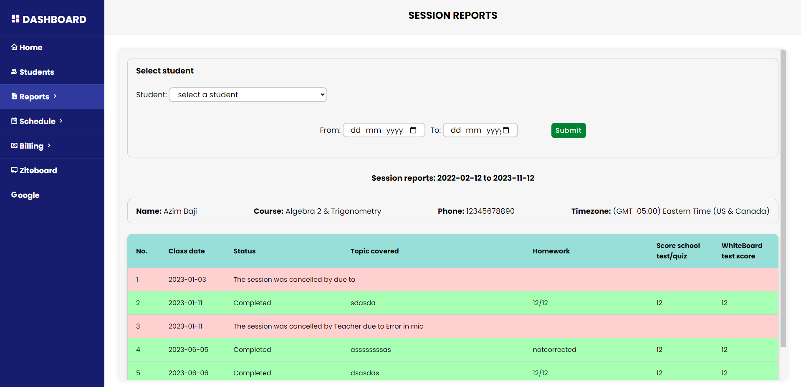

# Tuition Management System :mortar_board:

## Overview 🌟

The Tuition Management System is a comprehensive web application developed to enhance the efficiency and productivity of tutors in managing online tutoring sessions. Specifically created for CelestaCampus, an online tutoring company in Kerala, this system streamlines session scheduling, billing, report card generation, payment tracking, student tracking, and other academic-related tasks. With a focus on automating various processes, the system aims to simplify the administrative workload for tutors and provide a seamless experience for both tutors and parents.

## Features 🚀

- **Dashboard**: Access essential statistics, including total income, pending sessions, total students, and unpaid bills. A pie chart categorizes students based on their timezones.

- **Students Section**: Add, update, view, and delete student records. Maintain a comprehensive database of student information.

- **Reports Section**: Generate session reports within a specified date range. Automatically generate and email progress reports to parents and tutors.

- **Schedule Section**: Manage daily and weekly schedules. Assign, view, and update sessions for students.

- **Billing Section**: Generate bills for selected sessions, send bills to parents via email, and log payments received. Maintain a history of generated bills and track payment details.

## Screenshots 📸

*Screenshot of the dashboard.*

*Screenshot of the Students section.*

*Screenshot of the session reports section.*

*Screenshot of the daily schedule section.*

*Screenshot of the weekly schedule section.*

*Screenshot of the page to add report about the individual session.*

*Screenshot of the billing section to create new bill.*

*Screenshot of the generated, sent and completed bills.*

*Screenshot of the bill sent to the parent's email.*

*Screenshot of the PDF containing the student's progress report that is emailed to the parent.*

## How to Use 📖

### Dashboard :bar_chart:
1. **View Statistics**: Monitor essential statistics, including total income, pending sessions, unpaid bills, and total students.
2. **Pie Chart**: Visualize student distribution based on their timezones.

### Students Section :school:
1. **Add New Students**: Include new student records with relevant details.
2. **Update Information**: Modify and update student details as necessary.
3. **View Student Records**: Access student information.
4. **Delete Records**: Remove outdated or irrelevant student records.

### Reports Section :page_facing_up:
1. **Session Reports**: View session reports within a specified date range.
2. **Progress Reports**: Automatically generate and email progress reports in pdf form to parents.

### Schedule Section :calendar:
1. **Daily Schedule**: Assign, view, update daily schedules and enter session report for tutoring sessions.
2. **Weekly Overview**: View weekly schedules, including pending, assigned, and canceled sessions.

### Billing Section :money_with_wings:
1. **Generate Bills**: Create bills for selected sessions.
2. **Email Bills**: Send generated bills to parents via email for prompt payment.
3. **Payment Logging**: Can be used to log payments received, providing a detailed payment history.

## Installation 🔧

1. Host the application on a localhost or server.
2. Make sure to create a database named management_tuition and then import the provided `management_tuition.sql` file into the server's database which you just created. 
3. Install [Composer](https://getcomposer.org/) on your system.
4. Run `composer install` in the project directory to install dependencies.
5. Install [dompdf](https://github.com/dompdf/dompdf) using Composer: `composer require dompdf/dompdf`.
6. Configure SMTP details in `message.php` for the sendmail function.
7. In your local development enviornment (using XAMPP), configure SMTP details in your `php.ini` file for the `mail()` function.

## Notes ⚠️

- The system is responsive up to a view port resolution of 1280x800 from 1920x1080.
- Configure SMTP details from using all complete functionality.

## Developer 👨‍💻

- Developed by: Azim Baji Krishna
- Contact: azimbaji19@gmail.com
- Feedback and Support 💌: Feel free to reach out for feedback or support. Your insights contribute to the system's improvement.

Feel free to adapt and use this Tuition Management System to suit your needs! 😃
